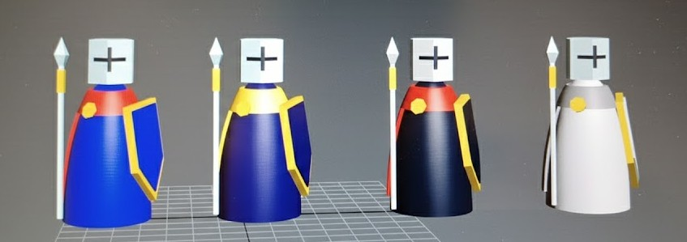
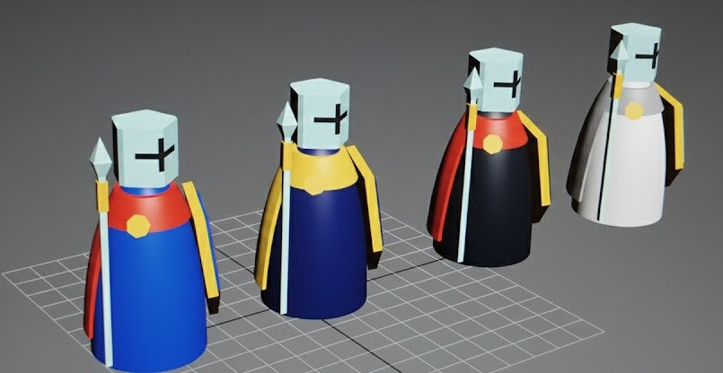

# 🤑🤖 Unity AI Greedy with PPO Reinforcement Learning

  
  

  

## 📝 Project Description
This project demonstrates **Reinforcement Learning** using **PPO (Proximal Policy Optimization)** in **Unity 3D** to train an AI agent to drive, navigate towards a target and catch coins.  
The character learns walking or car-like movement (forward, backward, turn left, turn right) to reach the yellow sphere (reward) through trial and error across multiple parallel training environments.

⚡️ Essentially, the AI learns driving skills autonomously by being rewarded for reaching its goal with realistic physics!

---

## ⚙️ Features

🧠 **PPO Reinforcement Learning** — State-of-the-art algorithm for training intelligent agents.  

🚗 **Car-like Controls** — Agent learns realistic driving mechanics (forward, backward, left turn, right turn).  

🎮 **Unity ML-Agents** — Leverages Unity's machine learning framework for 3D environments.  

🔄 **Parallel Training** — Multiple platforms train simultaneously to speed up learning.  

📊 **Visual Feedback** — Green platforms indicate successful goal reach within time limit, red indicates failure.  

🎯 **Simple Goal** — Character agent learns to drive towards yellow sphere reward.

---

## 📊 Example Outputs

### Neural Network Architecture
The AI agent uses a fully connected neural network trained with PPO:

**Input & Output Structure:**

  

**Layers & Constants:**

  

### Sensor System
The agent uses ray-based sensors to perceive its environment and make moving decisions:

  

### Trained Agent Performance
After training, the agent efficiently drives towards its target using car-like controls:

**Top-Down View:**

  

**Perspective View:**

  

### 3D Character Model
Custom Templar character model I created for this project (I wanted to create a model I can use for differente projects. I started with a chess pown, then a animal but I wanted a model without any need of movement so I made a Templar with different color to make team):

  
  

---

## 🧠 Training Visualization

The training process demonstrates reinforcement learning in action:
- **Character agents** = AI-controlled entities learning to drive  
- **Yellow spheres** = Target rewards to reach  
- **Green platforms** = Successful episodes (goal reached in time)  
- **Red platforms** = Failed episodes (timeout before reaching goal)
- **Ray sensors** = Visual perception system helping the agent understand its surroundings

As training progresses, you'll observe more green platforms appearing, indicating improved performance and successful goal completions. The agent learns to use its sensors effectively to navigate towards targets while avoiding obstacles.

---

## ⚙️ How it Works

1. 🎬 **Environment Reset** → Each platform initializes with random agent and target positions.  
2. 🤖 **Observation** → The agent observes its position, rotation, target position, and distance.  
3. 🧠 **Decision** → PPO algorithm decides driving actions (forward/backward, turn left/right) based on current policy.  
4. 🚗 **Action & Reward** → Agent performs car-like movements and receives rewards for getting closer or reaching the goal.  
5. 🔄 **Learning** → Neural network updates based on accumulated experiences across all platforms.  
6. ✅ **Success Indicator** → Platform turns green on success, red on timeout.

The parallel training approach significantly accelerates the learning process by gathering driving experiences from multiple agents simultaneously.

---

## 🧰 Components

| Component | Description |
|-----------|-------------|
| 🎮 **Training Platform** | Multiple parallel environments for simultaneous learning |
| 🚗 **Agent (Character)** | AI-controlled entity learning car-like driving mechanics |
| 🎯 **Goal (Yellow Sphere)** | Target reward the agent must reach |
| 🧠 **PPO Algorithm** | Reinforcement learning algorithm optimizing driving behavior |
| 📊 **Visual Feedback** | Color-coded platforms showing success (green) or failure (red) |
| ⏱️ **Time Limit** | Episode duration constraint for reaching the goal |
| 🎮 **Car Controls** | Forward, backward, turn left, turn right actions |

---

## 🚀 Getting Started

### Prerequisites
- Unity 2020.3 or later
- Unity ML-Agents Toolkit
- Python 3.7+ (for ML-Agents training)

### Installation
1. Clone this repository
2. Open the project in Unity
3. Install ML-Agents package via Package Manager
4. Configure training parameters in the YAML config file
5. Run training using `mlagents-learn` command

---

## 📖 Inspiration / Sources  

This project uses Unity's ML-Agents framework for reinforcement learning:
- [Unity ML-Agents Documentation](https://github.com/Unity-Technologies/ml-agents)
- [PPO Algorithm Paper](https://arxiv.org/abs/1707.06347)

Project created by me 😎, Thibault GAREL - [Github](https://github.com/Thibault-GAREL)
